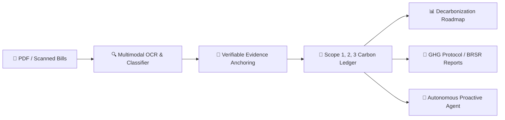

# Sensible Document Extractor

> **AI Document Intelligence & Sustainability Operations Platform**  
> *Deterministic OCR • Verifiable Evidence Anchoring • Scope 1, 2, 3 Carbon Accounting • Autonomous Proactive Agent*

[](https://fastapi.tiangolo.com)
[](https://react.dev)
[](https://tailwindcss.com)
[](https://github.com/pymupdf/PyMuPDF)
[](https://www.sqlalchemy.org)

---

## 📖 Complete Documentation Suite

- 🏛️ **[System Architecture & Technical Design](file:///home/raj/sensible/docs/ARCHITECTURE.md)**: Multimodal extraction pipelines, carbon accounting math, double-entry ledger architecture, proactive agent trigger engine, database schemas, and security model.
- ✨ **[Platform Features Guide](file:///home/raj/sensible/docs/FEATURES.md)**: In-depth catalog of all 5 core modules (Documents, Insights, Carbon, Reports, Agent) and 20+ subsystems.
- 🔌 **[REST API Reference](file:///home/raj/sensible/docs/API_REFERENCE.md)**: Complete FastAPI endpoint specifications, request payloads, response schemas, and OpenAPI guides.

---

## 🌟 Executive Summary

**Sensible Document Extractor** transforms unstructured operational documents (electricity bills, diesel receipts, water utility statements, waste manifests, and ESG audits) into audit-ready structured data, verified GHG Scope 1/2/3 accounting records, and regulatory disclosures.



### Key Differentiators
1. **Verifiable Evidence Anchoring**: Every single extracted number links directly to verbatim text snippets and bounding-box page coordinates in the source PDF.
2. **Deterministic Carbon Accounting**: Zero-blackbox calculations linking activity data $\times$ governed emission factors (DEFRA, CEA India, US EPA, IPCC) with double-entry ledger transactions.
3. **Autonomous Proactive Agent**: Background trigger engine continuously detects consumption anomalies, suggests high-ROI mitigation projects, and prepares regulatory compliance filings with human-in-the-loop sign-off.
4. **Resilient Hybrid Engine**: Full offline deterministic heuristics ensure 100% platform availability even when external LLM endpoints are unconfigured.

---

## 🚀 Quick Start Guide

### Prerequisites
- Python 3.10+
- Node.js 18+ and npm
- (Optional) `tesseract-ocr` for scanned image fallback

---

### Backend Setup (FastAPI)

```bash
cd backend
python3 -m venv venv
source venv/bin/activate
pip install -r requirements.txt
cp ../.env.example .env

# Run FastAPI Development Server
uvicorn app.main:app --host 0.0.0.0 --port 8005 --reload
```
- API Base URL: `http://localhost:8005`
- Interactive OpenAPI Swagger Docs: `http://localhost:8005/docs`

---

### Frontend Setup (React + Vite)

```bash
cd frontend
npm install

# Run Vite Dev Server
npm run dev
```
- Application Web UI: `http://localhost:5173`

---

### Build & Test Commands

```bash
# Frontend Production Build
cd frontend && npm run build

# Backend Pytest Suite
PYTHONPATH=. backend/venv/bin/pytest backend/tests/ -v

# MSME Real-World Validation Benchmark
PYTHONPATH=. backend/venv/bin/python backend/validation_dataset/run_validation.py
```

---

## 🗺️ Platform Architecture at a Glance

```
Sensible Document Extractor
├── 📁 Documents ▾
│   ├── All Documents (/documents)
│   ├── Needs Review (/documents?status=NEEDS_REVIEW)
│   ├── Ready Documents (/documents?status=COMPLETED)
│   ├── Verified Records (/documents?status=VERIFIED)
│   └── Document Detail & Evidence Anchors (/documents/:id)
│
├── 📊 Insights ▾
│   ├── Platform Metrics (/metrics)
│   ├── Industry Benchmarking (/benchmarks)
│   ├── Reduction Opportunities (/reduction-opportunities)
│   ├── Emission Forecast (/forecast)
│   ├── Reduction Intelligence (/reduction-intelligence)
│   ├── Reduction Roadmap (/reduction-roadmap)
│   └── What-If Scenarios (/emission-scenarios)
│
├── 🌿 Carbon ▾
│   ├── Carbon Footprint Dashboard (/carbon-dashboard)
│   ├── Activity Data Matrix (/activity-data)
│   ├── Emission Factor Registry (/emission-factors)
│   ├── Calculations Engine (/carbon-calculations)
│   ├── Double-Entry Carbon Ledger (/carbon-ledger)
│   └── Carbon Credit Readiness (/carbon-credit)
│
├── 📑 Reports ▾
│   ├── Compliance Reports Builder (/compliance-reports)
│   ├── Green Finance Eligibility (/green-finance)
│   └── Reduction Projects Tracker (/reduction-projects)
│
└── 🤖 Agent (/agent) & Floating Copilot
    ├── Autonomous Agent Center (/agent)
    └── Global Floating Copilot RAG Drawer (Ask AI)
```

---

## 🛡️ License & Enterprise Governance

Built for enterprise sustainability operations, regulatory carbon accounting, and industrial MSME decarbonization. All audit trails, extraction hashes, and double-entry ledger entries conform to GHG Protocol Corporate Standard and ISO 14064-1 verification principles.
