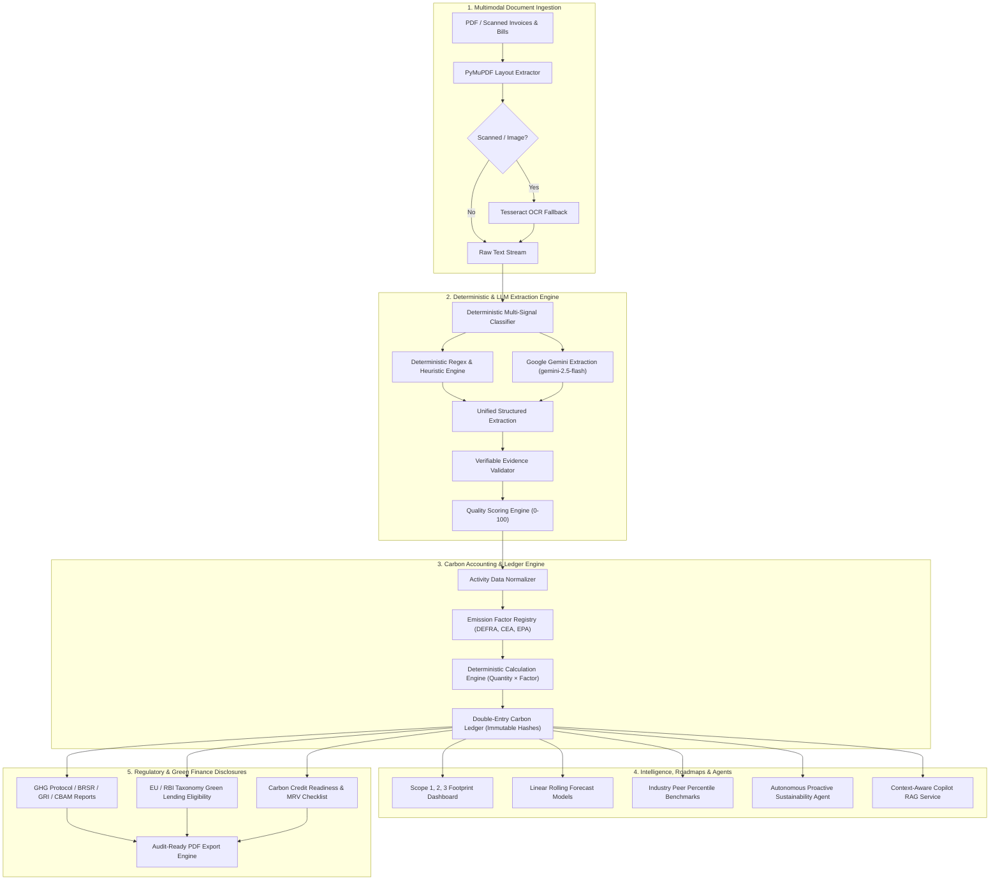
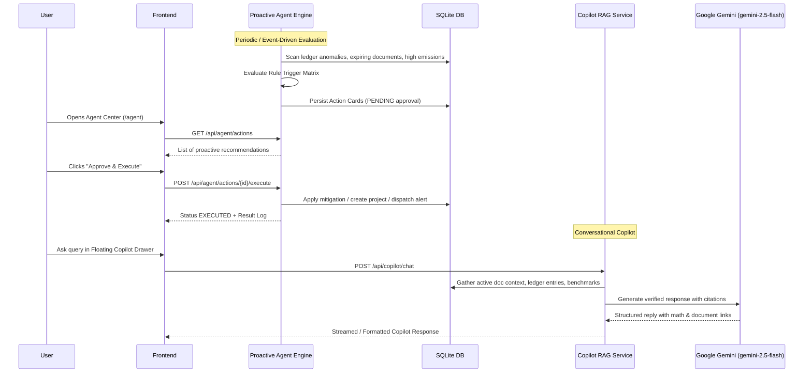
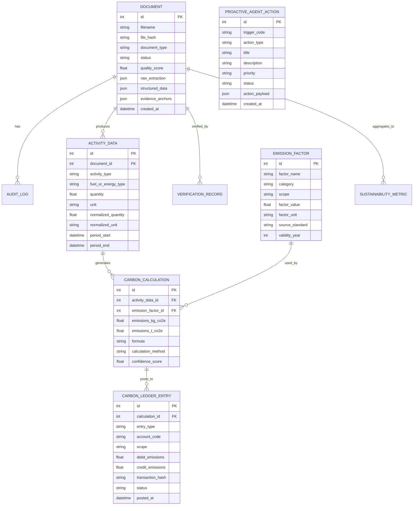

# Sensible Document Extractor — System Architecture & Technical Design

> **Enterprise Sustainability Intelligence & Document Extraction Platform**  
> *Deterministic AI • Verifiable Evidence • Scope 1, 2, 3 Accounting • Autonomous Agents*

---

## 1. System Overview

**Sensible Document Extractor** is an end-to-end enterprise sustainability intelligence and document processing platform. It ingests semi-structured and unstructured operational documents (utility bills, fuel receipts, ESG audits, waste manifests), extracts structured activity data with verbatim source evidence, normalizes metrics, calculates GHG emissions via governed emission factors, posts immutable double-entry ledger entries, and provides autonomous proactive recommendations, decarbonization roadmaps, and regulatory compliance disclosures (GHG Protocol, BRSR, GRI, CBAM).

---

## 2. Core Processing Pipelines

### Pipeline 1: Document Ingestion & Multimodal Extraction

1. **Ingestion & Duplicate Check**:
   - Computes SHA-256 hash of incoming PDF files. Duplicate uploads are detected immediately to avoid double-counting.
   - File is persisted under `uploads/` with secure UUID naming.
2. **Text & OCR Extraction**:
   - `PyMuPDF (fitz)` extracts text with layout geometry, character coordinates, and table structures.
   - If extracted text density is below threshold (< 50 characters/page), fallback to `pytesseract` OCR processes rendered page images.
3. **Multi-Signal Classification**:
   - Classifies documents into categories (`electricity`, `fuel`, `water`, `waste`, `esg_report`, `freight`, `logistics`) using deterministic keyword clusters, vendor matching, and consumption unit indicators.
4. **Hybrid Extraction**:
   - **Deterministic Heuristics**: High-precision regex pattern matchers for invoice numbers, meter numbers, dates, consumption values, and billing periods.
   - **LLM Structured Parser**: Google Gemini 2.5 Flash (`google-genai` SDK) invocation with strict JSON schema fallback for complex multi-line tables and narrative disclosures.
5. **Verifiable Evidence Validation**:
   - Validates that every extracted numeric value and unit exists verbatim in the source document text.
   - Computes confidence scores and marks exact character offsets / page numbers.
6. **Quality Scoring (0–100)**:
   - Deterministic algorithm evaluating completeness (invoice metadata, consumption, units, dates, vendor details) and evidence match integrity.
   - Scores below 80 are routed to the **Needs Review** queue for human verification.

---

### Pipeline 2: Activity Data Normalization & Carbon Accounting

1. **Activity Data Normalization**:
   - Converts raw document values into standardized SI units (e.g., kWh to MWh, Litres to Litres, Tonnes to kg).
   - Generates typed `ActivityData` records linked directly to the parent document and line-item evidence anchors.
2. **Emission Factor Registry & Resolution**:
   - Multi-standard factor registry incorporating DEFRA, Central Electricity Authority (CEA India v19), US EPA, and IPCC guidelines.
   - Matches factors based on activity type, region/grid, unit, and validity year.
3. **Deterministic Calculation Engine**:
   - Formula: $\text{Emissions } (t\text{CO}_2e) = \text{Activity Quantity} \times \text{Emission Factor} \times \text{GWP Multiplier}$.
   - Every calculation stores exact formula text, factor source, confidence level, and input references for zero-blackbox auditability.
4. **Double-Entry Carbon Ledger**:
   - Mimics financial accounting with debit/credit carbon accounts (Scope 1, Scope 2 Market-Based/Location-Based, Scope 3 Categories 1–15).
   - Immutable posted records with SHA-256 transaction hashes and cryptographic integrity verification.

---

### Pipeline 3: Autonomous Proactive Agent & Copilot RAG

1. **Trigger Engine**: Evaluates 12+ deterministic trigger rules (e.g., Scope 2 spike > 15% period-over-period, missing Scope 3 supplier data, low confidence extractions, renewable switch ROI > 20%).
2. **Action Lifecycle**:
   - `PROPOSED` &rarr; `ACCEPTED` / `REJECTED` &rarr; `EXECUTED` &rarr; `MEASURED`.
   - Complete human-in-the-loop oversight before any state modification.
3. **Copilot RAG Architecture**:
   - Ingests active document metadata, verbatim text chunks, emission calculation records, and sector benchmarks into prompt context.
   - Answers natural language inquiries with exact mathematical step-by-step breakdowns and document page citations.

---

### Pipeline 4: Decarbonization Intelligence & Scenario Modeling

1. **Emission Forecasting**:
   - Computes rolling linear trend extrapolations, seasonal moving averages, and target trajectory paths (e.g., Net Zero 2030 / 2050).
2. **Reduction Intelligence & Opportunities**:
   - Calculates deterministic energy efficiency, solar rooftop conversion, fleet electrification, and waste diversion ROI.
   - Evaluates capital expenditures (CAPEX), operational savings (OPEX), payback period in years, and abatement cost ($\$/t\text{CO}_2e$).
3. **What-If Scenario Engine**:
   - Interactive simulation sliders for renewable electricity share (0–100%), EV adoption (0–100%), and operational efficiency gains (0–50%).
   - Instantly recalculates dynamic Scope 1, Scope 2, and Scope 3 trajectory curves.

---

### Pipeline 5: Compliance, Green Finance & Carbon Credit Readiness

1. **Regulatory Disclosures**:
   - **GHG Protocol**: Corporate Standard Scope 1, 2, and 3 accounting breakdown.
   - **BRSR (India)**: Business Responsibility and Sustainability Reporting Principle 6 format.
   - **GRI (Global Reporting Initiative)**: GRI 302 (Energy), GRI 305 (Emissions), GRI 306 (Waste).
   - **CBAM (EU Carbon Border Adjustment Mechanism)**: Embedded emission intensity per production unit.
2. **Green Finance Assessment**:
   - Scores company metrics against EU Taxonomy and RBI Green Lending criteria.
   - Generates Bank-Ready Green Loan Dossiers with verified debt service coverage and emission reduction commitments.
3. **Carbon Credit Readiness**:
   - Evaluates additionality, permanence, baseline methodology, MRV (Monitoring, Reporting, Verification) checklist, and double-counting risk against Gold Standard / Verra standards.

---

## 3. Technology Stack

| Layer | Technologies | Purpose |
| :--- | :--- | :--- |
| **Frontend** | React 18, Vite 5, Tailwind CSS, Lucide Icons, Recharts | Fast, responsive B2B enterprise SaaS interface with dark/light aesthetics, interactive charts, and PDF review |
| **Backend API** | Python 3.10+, FastAPI, Pydantic v2, Uvicorn | High-performance asynchronous REST API with automatic OpenAPI documentation and strict type validation |
| **Document Processing** | PyMuPDF (fitz), Tesseract OCR, regex | Layout-preserving PDF extraction, table extraction, and image OCR fallback |
| **AI / LLM Layer** | Google Gemini 2.5 Flash (`google-genai` SDK, Optional), Deterministic Regex Engine | Structured JSON extraction, conversational Copilot RAG, and automated reasoning with non-hallucinating fallback |
| **Database & ORM** | SQLite / PostgreSQL-ready, SQLAlchemy 2.0 | Relational storage for documents, ledger entries, emission factors, and audit logs |
| **PDF Reporting** | ReportLab, Canvas Engine | Audit-grade vector PDF generation for compliance disclosures and green finance dossiers |
| **Testing & QA** | Pytest, Playwright / Browser Agent | Automated unit tests, integration suites, and end-to-end browser verification |

---

## 4. Database Architecture & Data Models

---

## 5. Security, Auditability & Governance

1. **SHA-256 Immutability**:
   - Every uploaded document and ledger transaction receives a cryptographically verifiable SHA-256 hash.
2. **Immutable Audit Trail**:
   - Every human edit, field verification, status transition, and agent execution is recorded in the `audit_logs` table with user identification, previous value, new value, reason, and timestamp.
3. **Deterministic Fallbacks**:
   - If external LLM APIs are unreachable or unconfigured, the entire platform runs 100% deterministically using rule-based heuristics and local emission factor registries.
4. **Zero-Blackbox Formulas**:
   - Every carbon number displays its mathematical equation, emission factor citation, and verbatim source evidence.
